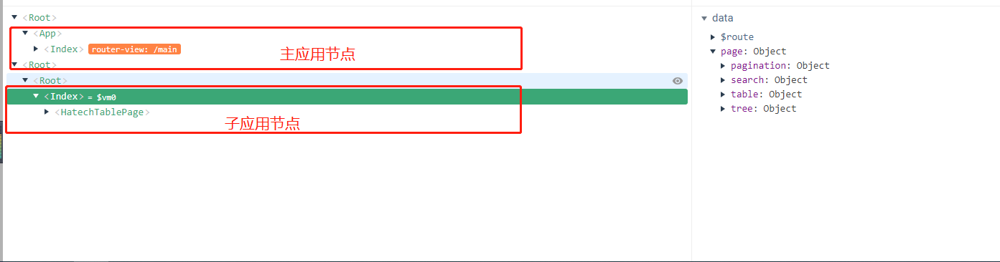

<!--

 * @Author: liuzhihao
 * @Date: 2021-06-29 13:29:50
 * @LastEditors: liuzhihao
 * @LastEditTime: 2021-06-29 14:12:01
 * @description: 
   -->

# 前端微应用模板

此项目模板为微应用模板，提供如下功能点：

* 基于qiankun的微应用对外接口处理
* 对接主应用传递、接收数据
* 集成Vue\Vue Router\Vuex\HTTP请求等核心功能
* 集成svg icon图标、常用工具库等辅助功能
* 集成主题接入、切换功能

需要注意的是，此模板在1.0的基础上更新了路由相关内容，在主应用加载微应用时，会将主应用的router对象传递过来，微应用需要切换路由时，将使用主应用的router对象进行路由切换，即所有的路由都由主应用管理维护一个VueRouter对象，子应用只实现页面。

## 使用说明

* 使用`hatech create`命令行程序

  ```sh
    $ hatech create
    ? 请选择您要创建的类型： (Use arrow keys)
      Vue项目组件，集成Vue、Vue-Router、Vuex、HTTP请求、ElementUI、主题切换等 
      微前端主应用项目，集成qiankun，应用间通信等功能 
    > 微前端子应用项目，集成qiankun，应用间通信等功能 
      组件模板，集成组件生命周期事件发射，props标准等 
      布局模板，集成基本头、侧边栏等布局要素 
      主题模板，集成基本主题样式包编辑模板 
      Mocker服务器，支持HTTP请求 
  ```

* 使用`git clone GIT_ADDRESS`

  ```sh
    git clone http://git.hatech.com.cn:8088/hatech-web/hatech-web-template-project-micro-sub.git
  ```

* 微前端环境下，使用vue-devtools调试子应用。

 ```sh
    由于子应用实例没有父节点来继承它，需要手动配置一下。
    function render(props) {
    ...省略
    // 解决vue-devtools在qiankun中无法使用的问题
    if (window.__POWERED_BY_QIANKUN__ && process.env.NODE_ENV === 'development') {
        // 配置vue-devtools  
        const instanceDiv = document.createElement('div')
        instanceDiv.__vue__ = instance
        document.body.appendChild(instanceDiv)
    }
}

 ```




## 注意

    模板项目的默认打包路径是'/', 如果需要指定路径，需要修改 vue.config.js 的 publicPath ，同时也需要在 `src/main.js` 文件 new VueRouter 方法 里面增加base配置并且和publicPath一致.在生产环境中，主应用中配置微应用entry(微应用真实访问地址)中的英文路径应和子应用的publicPath一致。

